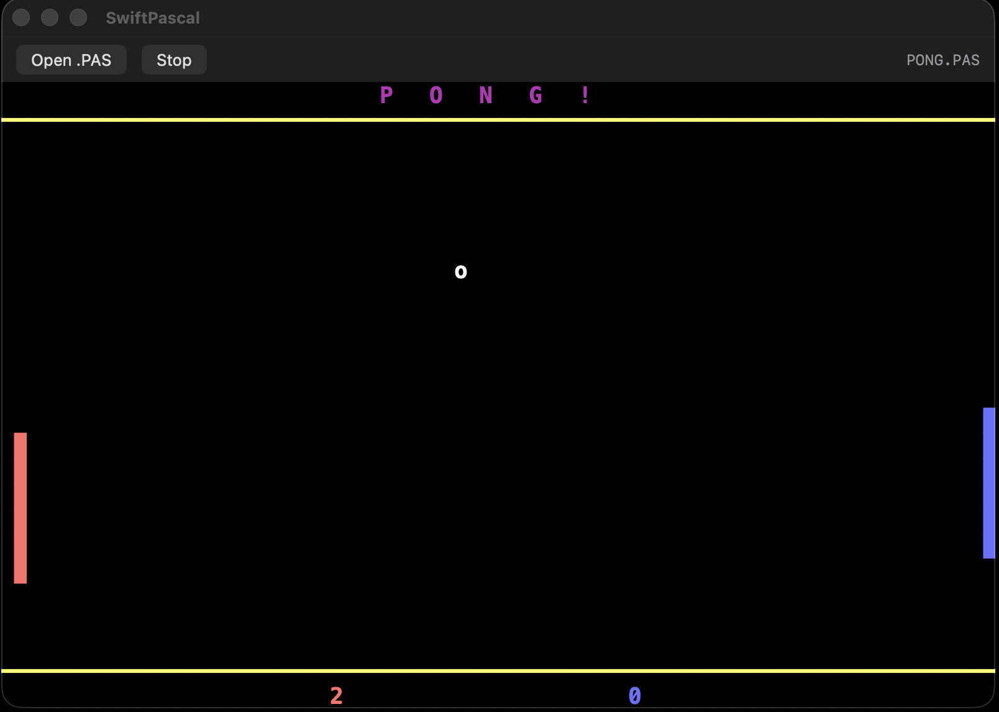
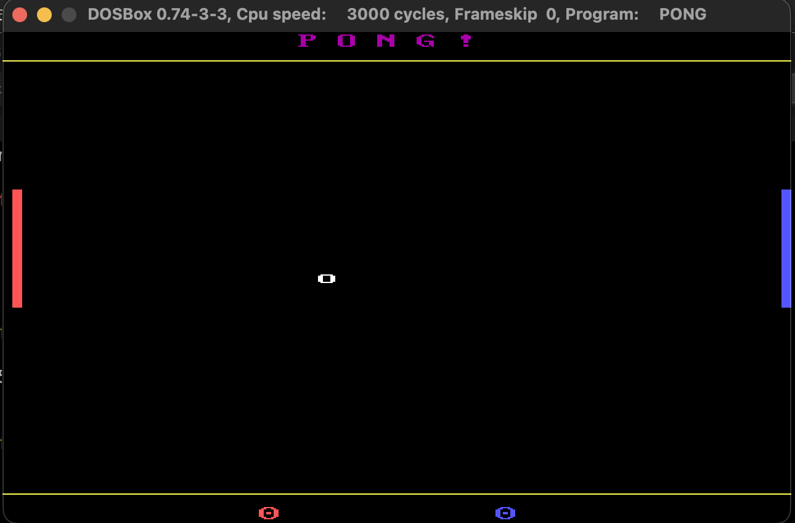

# Swift Pascal

A Pascal interpreter written in Swift that runs Turbo Pascal-era (ca. 1987) programs in a simulated DOS text-mode terminal.



## What is this?

Swift Pascal is a macOS app that interprets Pascal source code from the late 1980s. It provides an 80x25 (or 40x25) character terminal with CGA 16-color graphics, simulating the DOS experience of running a Pascal program on an IBM PC.

The interpreter was built specifically to run programs from the Turbo Pascal era, including a two-player PONG game originally written by the developer in Turbo Pascal 3 and published in Pascal International, February 1988.

## Building

Requires **macOS 14+** and **Swift 5.10+**.

```
swift build
.build/debug/SwiftPascal
```

Or open the project in Xcode:

```
open Package.swift
```

## Usage

1. Launch the app
2. Click **Open .PAS** (or Cmd+O) to load a Pascal source file
3. The program runs immediately in the terminal view
4. Click **Stop** (Cmd+.) to halt execution, **Run** (Cmd+R) to restart

Keyboard input goes directly to the running program. Click on the terminal to ensure it has focus.

## Language Features

### Declarations
- `PROGRAM`, `USES`, `CONST`, `VAR`, `TYPE`
- `PROCEDURE` and `FUNCTION` with nesting and local declarations
- Parameter passing (by value)

### Types
- `INTEGER`, `REAL`, `CHAR`, `STRING[n]`, `BOOLEAN`
- Subrange types (`1..100`, `-1..1`)
- Multi-dimensional arrays (`ARRAY [1..25, 1..40, 1..2] OF CHAR`)
- `ABSOLUTE` memory mapping for direct video memory access

### Control Flow
- `IF` / `THEN` / `ELSE`
- `FOR` / `TO` / `DOWNTO` / `DO`
- `WHILE` / `DO`
- `REPEAT` / `UNTIL`
- `BEGIN` / `END` compound statements

### I/O
- `Write`, `WriteLn` with format specifiers (`:width`, `:width:decimals`)
- `Read`, `ReadLn` (including to array elements)
- `Read(Kbd, c)` for single-character input without echo

### Built-in Functions
`Chr`, `Ord`, `Pred`, `Succ`, `Random`, `Pos`, `Copy`, `Length`, `Concat`, `UpCase`, `Abs`, `Sqr`, `Sqrt`, `Round`, `Trunc`, `Odd`

### CRT Unit
`ClrScr`, `GotoXY`, `TextColor`, `TextBackground`, `TextMode`, `KeyPressed`, `Delay`, `Sound`, `NoSound`, `GraphBackground`

### DOS Simulation
- **Video memory**: `ABSOLUTE $B800:0` maps array writes directly to the terminal buffer, exactly like CGA text mode
- **Mem[] access**: `Mem[segment:offset]` for BIOS data area simulation
- **PC Speaker**: `Sound(frequency)` / `NoSound` generate square-wave tones via AVAudioEngine
- **CP437 characters**: Box-drawing and block elements (lines, corners, half-blocks, shading) are rendered as pixel-perfect geometric shapes
- **CGA palette**: All 16 colors including the blink attribute
- **Text modes**: 40-column (`C40`) and 80-column (`C80`)

## Architecture

```
Sources/
  SwiftPascal/                    # macOS app (SwiftUI + AppKit)
    SwiftPascalApp.swift          # App entry point
    ContentView.swift             # Main window layout
    TerminalView.swift            # NSView-based terminal renderer
    TerminalStore.swift           # Bridges interpreter <-> UI
  SwiftPascalCore/                # Interpreter library
    Lexer/                        # Tokenizer (case-insensitive, hex, CP437)
    Parser/                       # Recursive descent parser -> AST
    Interpreter/                  # Tree-walking async interpreter
    Terminal/                     # 80x25 character+attribute buffer
    Units/                        # Sound engine (AVAudioEngine)
```

The interpreter runs asynchronously, allowing `Delay` calls and keyboard input without freezing the UI. The terminal view refreshes at 30fps for smooth animation.

## Sample Programs

| File | Description |
|------|-------------|
| `PONG.PAS` | Two-player Pong game (ca. 1987). Uses direct video memory, sound, 40-column mode. |
| `HELLO.PAS` | Hello World with colored text |
| `COLORS.PAS` | Displays all 16 CGA colors |

## Running Tests

```
swift test
```

## Comparison

| | DOSBox (original) | Swift Pascal |
|---|---|---|
|  |  |

## License

MIT
